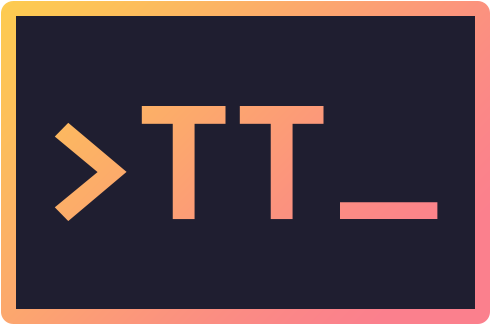

 

#

<strong>TerminalTrivia, a Trivia quiz game playable directly from your terminal 💻⚡️</strong>

 
 

## Table of Contents

1. [Play](#play)
2. [Technologies](#technologies)
3. [Guides and resources](#guides-and-resources)
4. [Authors](#authors)
5. [License](#license)

## Play

There are two ways to run the game:

1. **Run the executable:** The first and fastest way is to simply download the game executable (packaged in zip format) from the [releases section](https://github.com/d-roduit/TerminalTrivia/releases) and run it. There is only a release for Windows though, so if you use another operating system, please follow the second option.
2. **Build the executable from source:** This project uses CMake. To build the executable, the fastest way is to download this project and open it in an editor that supports CMake (e.g. Visual Studio). The editor will use CMake to automatically download the project's dependencies when you first open the project _(CMake uses Git to download the dependencies. It is therefore required to have Git installed beforehand)_. Then, use the editor to build the executable in the configuration of your choice (Debug / Release). You do that by first choosing a build configuration (Debug is the default) then clicking on `Build > Build all` in the menu bar. The debug / release folder, which contains the executable, will be located in the `out\build` folder at root of the project.

## Technologies

The game has been entirely developed in C++.

The main content of the game, aka the quiz questions, are fetched from the [Open Trivia DB](https://opentdb.com/) API.

Moreover, it uses the following C++ libraries :
- [FTXUI](https://github.com/ArthurSonzogni/FTXUI) - for the development of the terminal user interface
- [C++ Requests](https://github.com/libcpr/cpr) - for making HTTP requests to the Trivia API
- [JSON for Modern C++ ](https://github.com/nlohmann/json) - for parsing the HTTP responses returned by the Trivia API
 
## Guides and resources

* [CMake](https://cmake.org/) - Software for build automation, testing, packaging and installation of software
* [FTXUI](https://github.com/ArthurSonzogni/FTXUI) - Functional Terminal User Interface library
* [C++ Requests](https://github.com/libcpr/cpr) - HTTP requests library
* [JSON for Modern C++ ](https://github.com/nlohmann/json) - JSON library
* [Open Trivia DB](https://opentdb.com/) - User-contributed trivia question database

## Authors

<table>
   <tbody>
      <tr>
         <td align="center" valign="top" width="100%">
            <a href="https://github.com/d-roduit">
             
            Daniel Roduit
            </a>
         </td>
      </tr>
   </tbody>
</table>

## License

This project is licensed under the MIT License
